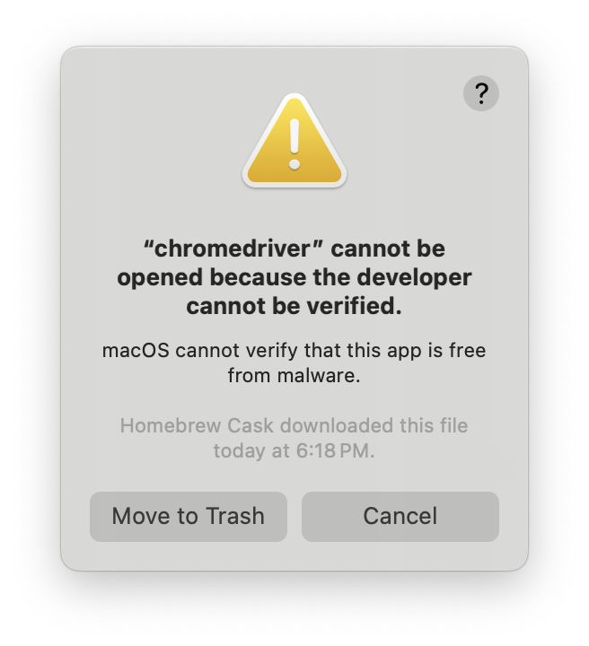

# SIS Bot v4 #
### (updated from nkrishn9's and yzhan289's SIS Bots)  ###

This selenium bot allows you to register for classes on the Johns Hopkins SIS portal right at 7:00 AM, virtually guaranteeing a spot in all of your classes.

### WARNING: This has only been tested on Mac OS and Chrome (and will probably only work on it). ###

## Setup Instructions ##
Open Terminal and navigate to the directory you wish to install in (e.g. ~/Documents). Run the following commands:
```
git clone https://github.com/bwong19/SIS-Bot.git
cd SIS-Bot
pip install -r requirements.txt
brew install chromedriver
```

SIS uses the naval observatory clock to determine time. Therefore, your system must be synced to this clock to ensure the bot does not click too early or too late. On Mac OS, it is really easy to change your default.

1. Navigate to System Preferences and click Date and Time.
2. Click the lock on the bottom left of your window and enter your password.
3. Change "Apple Americas/U.S. (time.apple.com.)" to "tick.usno.navy.mil"
4. Click the lock again to save your changes.


## Running Instructions ##
Make sure your cart is ordered by priority. If there is a class that is waitlisted, requires override, requires approval, etc. place it lower on the list.

Run the command.
```
python bot.py jhed@jh.edu
```
The bot will then prompt you for your password.
If you have both a graduate and undergraduate record, SIS may ask you to select which one you want to register for. In this case, run the following command instead:
```
python bot.py jhed@jh.edu grad
```

Begin running about a minute before 7:00 AM. The program will wait/keep running until 7:00 AM to register you for your classes.

## Debugging ##
If you run into an error where chromedriver cannot be verified (see below), remove the quarantine from the chromedriver binary. This command will only be effective once since the quarantine won't exist afterwards, so if you can't run it again successfully, chances are it works.

```
xattr -d com.apple.quarantine $(which chromedriver)
```

